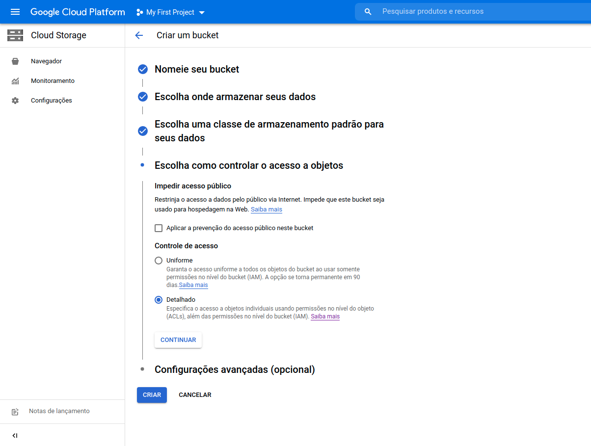

## DEPLOY DE APLICAÇÕES REACTJS

Nesse artigo eu vou explicar como fazer o deploy de uma aplicação feita com ReactJS, no geral aplicações front-ent é muito mais facil de colocar em produção do que back-end, mas nesse tutorial eu vou mostrar 2 alternativas diferentes para fazer deploy, a primeira opção com um nível iniciante e intermediário e a segunda alternativa com um nível mais avançado.

Na primeira alternativa vamos utilizar o netlify para fazer o deploy do nosso app reactjs, poderiamos utilizar outros semelhantes como o heroku, vercel e até mesmo firebase cloud, essa é uma forma mais simples de fazer deploy porém cheia de recursos e vai atender muito bem sua necessidade, tem um custo muito baixo com opção 100% gratuita.

Na segunda alternativa gera um custo um pouco maior que a primeira alternativa, é uma forma mais avançada de deploy e só recomendo utilizar essa forma de deploy quando existir a necessidade de escalar ainda mais seu projeto, nessa opção vamos utilizar uma **CDN**, que seria um servidor especifico para servir arquivos estáticos (HTML, CSS, Javascript), nesse tutorial vamos utilizar o **Google Cloud Plataform** porem você também tem outras opções como o amazon s3 da AWS ou qualquer outro tipo de CDN.

## Preparando projeto para deploy

Como utilizamos o "Create React App" para criar esse projeto não teremos dificuldade para deixar pronto para deploy, se você observar o package.json vai ver que ja até existe um script para fazer build do projeto.

Porém é necessário que você tenha configurado suas variaveis de ambiente no projeto, nesse projeto do **goBarber** por exemplo temos um serviço de api então criamos um `.env` na raiz do projeto com a variável de ambiente `REACT_APP_API_URL` e utilizamos no `src/services/api.ts`.


> **NOTA**: é necessário que no início do nome de toda variavel que você criar insira o "REACT_APP" seguindo esse modelo "REACT_APP_NOME_DA_VARIAVEL"

## Deploy utilizando o Netlify

O netlify é uma ótima opção para fazer deploy de aplicações ReactJS, sem duvidas é uma plataforma para hospedagem maravilhosa e o melhor de tudo é que ele tem um plano gratuito muito bom, também existem outros serviços como o heroku, vercel e etc...

> **NOTA**: é necessário que você tenha um cadastro no netlify, e que você tenha seu projeto em um repositório no GitHub, GitLab ou Bitbucket.


Após fazer login no netlify, navegue até o menu **Sites** e em seguida clique no botão **New site from Git**.


Escolha uma opção para fazer a integração do seu repositório, nesse caso meu projeto está no **GitHub** entao foi a opção que escolhi.


Procure pelo seu repositório e clique nele.


Agora se você criou seu projeto com o "Create React App" igual fizemos no projeto gobarber você mantem as configurações como mostra nas imagens abaixo, clique no botão **Show advanced**.


Você vai perceber que temos novas opções uma delas é o botão **New variable** vamos clicar nele para inserir nossa variavel de ambiente, em seguida clique no botão **Deploy site**.


Feito os passos anterior você vai parar em uma tela como mostra a imagem abaixo, o processo de deploy da aplicação iniciou.


Com essa opção de deploy no netflify conseguimos utilizar recursos como: funções serveless, CI/CD, previews de pull requests, certificado ssl gratuito com let's encrypt, CDN para arquivos grandes, Analytics, autenticações, utilizar formulários, personalizar seu dominio nas opções de gerenciamento de dominios e etc..., enfim conseguimos fazer bastante coisa utilizando o deploy com o netlify.

## Deploy utilizando CDN (Google Cloud Plataform)

O google cloud plataform tem um opção chamada **Cloud Storage** onde podemos criar um Bucket para hospedar nossos arquivos estaticos gerados na build do projeto, nesse tutorial utilizamos o Storage do GCP (Google Cloud Plataform) porém você também pode criar esses Buckets em diversos outros serviços de CDN como por exemplo o **S3 da AWS**, a seguir vamos aprender:

- Criar um bucket
- Configurar conta de serviço e permissões
- Configurar a pagina inicial
- Criar um workflow do GitHub Actions
- Apontar o dominio

Faça um cadastro no [Google Cloud Plataform](https://cloud.google.com/), no primeiro cadastro você ganha um crédito de $300 dólares para usar nos proximos 90 dias, além de poder utilizar mais de 20 recursos de forma gratuita, após fazer o cadastro navegue até a opção de [Cloud Storage](https://console.cloud.google.com/storage/).

### Criando bucket

Vamos criar o nosso bucket, uma nota importante é que ao nomear o bucket coloque o dominio da sua aplicação isso fará com que habilite algumas opções adicionais.


Importante você ter autoridade sobre o dominio que voce vai utilizar, ou seja ele precisa ser seu, o google verifica se voce tem essa autoridade, com o usuario que você esta utilizando os serviços do google cloud plataform, acesse o o [search console](https://search.google.com/search-console/) e adicione o dominio para seu usuario utilizando um dos meios de validação, em seguida insira o dominio do seu projeto.


Nesse opção eu mantive a opção com melhor custo/beneficio, a latencia é baixa para servidores na carolina do sul, você pode escolher servidores no brasil em São Paulo porém fique ciente que o custo é muito maior.


Mantenha opção "**Standard**"


Mantenha a opção "**Uniforme**"


Mantenha opção "**Chave de criptografia gerenciada pelo Google**" e clique em "**Criar**"


### Configurar contas de serviço

Vamos agora configurar uma conta de serviço, ela vai servir para conseguirmos utilizar a API do google cloud plataform, dessa forma conseguimos acessar o bucket, criar arquivos, deletar arquivos e muito mais sem precisar ficar acessando a plataforma da google.

Primeiro vamos navegar ate o menu "**IAM e Administrador**" em seguida no menu lateral procure por "**Contas de serviço**" e por ultimo clique no botão "**Criar conta de serviço**" no menu horizontal superior, no final voce irá chegar nesse formulário:


Dê um nome mais descritivel possivel, essa conta vamos utilizar no nosso gitHub Actions, depois de preencher tudo corretamente clique em "**Concluir**", após isso sua conta sera criada.


### Criando chave JSON (permissões)

Com a conta de serviço criada vamos criar uma chave privada, siga as instruções abaixo:

- Clique na sua conta de serviço
  

- Navegue até a guia "**CHAVES**"
  

- Clique no botão "**ADICIONAR CHAVE**" em seguida na opção "**Criar nova chave**"
  

- Escolha a opção "**JSON**" e clique em "**CRIAR**" faça o download da chave.
  

- Por fim a chave que voce fez download guarde ela
  

### Configurando a conta de serviço no bucket

O primeiro passo dessa etapa é copiar o endereço da conta de serviço, faça como na imagem abaixo copie o endereço da sua conta:

**ex:** *deploy-reactjs-github-actions@skilful-asset-323515.iam.gserviceaccount.com*


Agora vamos navegar até o nosso bucket, voce pode pesquisar por "**Storage**" e procurar pelo bucket que criamos, em seguida clique nele:


Navegue até a guia "**PERMISSÕES**"


Após clicar em "**PERMISSÕES**" aguarde carregar e em seguida clique no botão "**ADICIONAR**"


Preencha os dados como mostra a imagem abaixo, no campo "**Novos membros**" insira o endereço que copiamos da **conta de serviço**, e no campo "**Selecionar papel**" escolha a opção de **administrador de objeto de storage**.


### Configurando página inicial

Um dos motivos para criar um bucket com o nome do dominio que vamos utilizar na aplicação é justamente para liberar esse recurso pela interface de poder escolher a pagina inicial, se tivesse criado o bucket utilizando um nome simples ao invés do dominio esse recurso não seria liberado, e ai teria que fazer isso através de linha de comando.

Para configurar navegue até o nosso bucket e clique naquele menu de ações (3 pontinhos) em seguida escolha a opção "**Editar configuração de site**"


Na primeira opção onde definimos a pagina inicial, utilizamos o arquivo **index.html** pois é o arquivo principal na build do react, também vamos utilizar esse mesmo index.html na opção de página de erro 404, pois como nossa aplicação foi desenvolvida com ReactJS nossas rotas são gerenciadas pelo react ao contrário de um site comum onde suas rotas são arquivos do servidor, pastas e etc... por fim clique em **salvar**.


Feito a configuração, nosso bucket já esta pronto, se você jogar la dentro um arquivo index.html verá que ele já está funcionando.

### Workflow github actions

Vamos configurar o workflow de CI (Integração contínua), toda vez que fazemos um novo commit no repositório basicamente ele envia a build do código atualizado do projeto para a CDN (no caso no bucket do google cloud plataform).

Vamos pegar o id do nosso projeto no google cloud plataform, é muito facil procure no menu horizontal superior o nome do projeto e clique nele, nesse exemplo da imagem a seguir o nome do nosso projeto é "**My First Project**" clicando nele ja podemos visualizar o **ID** do projeto que nesse exemplo é "**skilful-asset-323515**"


O próximo passo é ir no repositório do seu projeto lá no github, clicar em **settings** e em seguida no meu sidebar (lateral esquerda) clicar na opção **secrets**, vamos criar nossas secrets que são variaveis secretas que serão utilizadas no script de build do projeto.


Agora vamos clicar no botão "New repository secret" e vamos criar nossa primeira variável secreta, o nome será **GCP_PROJECT** onde o valor vai ser o **ID** do projeto que copiamos, e por fim clique no botão "**Add secret**".


Feito isso vamos criar outra variável secreta que terá o nome "**GCP_SA_KEY**", o valor dessa variável será o conteúdo daquele arquivo **.json** que baixamos em passos anteriores desse tutorial, temos que converter o conteúdo desse arquivo para **base64**, se você é usuario de um sistema operacional Linux ou MacOS é facil siga as instruções abaixo:

```bash
# Navegue até o local onde está o arquivo .json
# Execute o comando:
$ cat nome-do-arquivo.json | base64

```

> Ex:
> 

Por fim crie a variável e coloque o conteúdo convertido para base64 no valor da variável, agora vamos navegar no menu "**Actions**" e criar nosso **workflow** clicando em "**set up a workflow yourself**".

> 

Abaixo está o código do nosso workflow com as explicações nos comentarios, copie o conteúdo abaixo e cole no lugar onde inserir o workflow.

```bash
name: CI

on:
  push:
    branches: [main]

env:
  # coloque aqui o nome do seu bucket
  BUCKET: appreactjs.soaresdev.com

jobs:
  build:
    runs-on: ubuntu-latest

    steps:
      # aqui ele pega a versão mais atualizada do código
    - uses: actions/checkout@v2

      # instala a versão do node que você definir
    - name: Setup Node.js
      uses: actions/setup-node@v1
      with:
        node-version: 12.x

     # instala as dependencias do projeto
    - name: Install dependencies
      run: yarn install

    # caso sua aplicação possui testes ele executa os testes, caso não tenha comente essa parte.
    # - name: Run tests
    #   run: yarn test --watchAll false

    # executa o script de build do projeto
    - name: Build
      run: yarn build

    # aqui ele instala a CLI do google cloud plataform dentro do bucket
    - uses: GoogleCloudPlatform/github-actions/setup-gcloud@main
      with:
        version: '290.0.1'
        project_id: ${{ secrets.GCP_PROJECT }}
        service_account_key: ${{ secrets.GCP_SA_KEY }}
        export_default_credentials: true

    # aqui ele utiliza a CLI do google cloud plataform para copiar o conteudo (build) do projeto para dentro do bucket
    - name: Upload filed to bucket
      run: gsutil -m rsync -R ./build gs://"$BUCKET"

    # aqui ele utiliza a CLI do google cloud plataform para dar permissão publica para acesso dos arquivos
    - name: Allow public access
      run: gsutil -m acl ch -R -u AllUsers:R gs://"$BUCKET"

    # aqui ele utiliza a CLI do google cloud plataform para setar comandos onde configura o cache de arquivos como imagens e javascript
    - name: Set Cache-Control
      run: gsutil -m setmeta -h "Cache-Control:public, max-age=15768000" gs://"$BUCKET"/**/*.{png,svg,css,js}

    # aqui ele utiliza a CLI do google cloud plataform para setar um comando que faz retirar o cache o arquivo index.html
    - name: Set Cache-Control
      run: gsutil setmeta -h "Cache-Control:no-cache, no-store" gs://"$BUCKET"/index.html
```

Para finalizar clique no botão "**Start commit**" e em seguida no botão "**Commit changes**".


Toda vez que voce fazer um commit no repositório, irá iniciar um deploy no bucket, você pode acompanhar esse workflow na sessão "Actions" como mostra a imagem abaixo:
